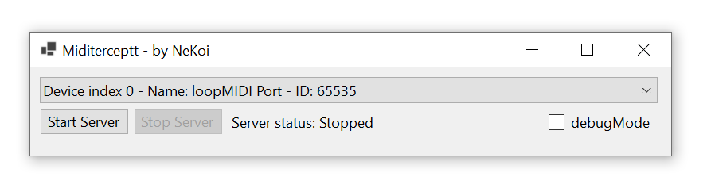

# midinterceptt
Midi event interceptor for showing events on OBS via webview (WIP)

## UseCase
OBS can't handle WebMIDI events and it is a pain to configure something to trigger mask layers or effects using it. So, the main idea is to use this tool to generate color layers, animations, etc and displaying via OBS (or another software capable of rendering webpages).

## Ussage


The dropdown list shows available midi devices, after selecting the desired midi device, it will start listening to clock and key events and publishing via websocket. Then you can use `index.html` to capture the stream or create a consumer on your own.

## Stream spec
Each event is published at port `9999` via `ws://localhost:9999/midiTick` ws endpoint. An example of structure of a event is as follows:

```json
{
  "type": "NoteOn",         // Can be NoteOn, NoteOff, TimingClock
  "bpm": 127.9317697228145,
  "noteName": 65,           //Optional if not TimingClock event
  "noteNumber": 65,         //Optional if not TimingClock event
  "velocity": 64,           //Optional if not TimingClock event
}
```

## Bpm calculation
There are no raw events passed via websocket, in order to ease commuinication. Events are currently passed for each clock tick (1 beat), and then updated. This way, we prevent sending too many objects via the socket and overloading a browser. Details on how clock is calculated are available on `Miditerceptt\Form1.Designer.cs`.

## index.html
Effects are being loaded as css effects, using `div`s as layer components for the composition. Feel free to create your own animations using CSS. If you want to use this file as a base for your compositions, then you should look at the following methods:

* `clockBeatSequence`: function called when a `TimingClock` message is sent. Can be used to trigger events using BPM, like a beat.
* `noteOnSequence`: function called when a `noteOn` message is sent. Can be used to trigger button actions from a midi controller. For the demo, it resets a color strobe animation.
* `noteOffSequence`: function called when a `noteOff` message is sent. Can be used to trigger button actions from a midi controller. For the demo, it deactivates a color strobe animation.

## WIP
This is a work in progress and just a *proof of concept*, as such, it's intended in the future to support other platforms and use Python as a language of choice instead of C#.

There is no roadmap for this project, so if you have any ideas, feel free to drop an issue to discuss it.